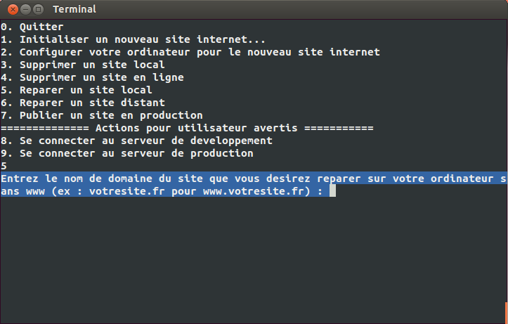

Foire aux questions
===================

1. Que faire si je rencontre cette erreur symfony 'The directory "/var/www/sites_symfony/applications/__domaine_du_site__/app/cache/dev/annotations" is not writable' ?
----------------------------------------------------------------------------------------------------------------------------------------------------

Traduction : Le repertoire "/var/www/sites_symfony/applications/__domaine_du_site__/app/cache/dev/annotations" n'est pas accessible en écriture

Ceci est lier au fait que le repertoire de cache 'app/cache/dev' a partir de la 'racine de l'application'* n'a pas les droit pour être écrit par l'utilisateur nobody (autre utilisateur d'apache)'

Pour le resoudre reportez vous a la question n°5

2. Que faire si je rencontre cette erreur symfony 'SQLSTATE[HYooo] [14] unable to open database file' ?
-------------------------------------------------------------------------------------------------------

Ceci est lier au fait que le fichier dev.sqlite situé repertoire contenant les bases sqlite spip/config/bases à partir de la 'racine de l'application'* ou le répertoire lui même n'a pas les droit pour être écrit par l'utilisateur nobody (autre utilisateur d'apache)'

Pour le resoudre Reportez vous a la question n°5

3. Que faire si je rencontre cette erreur symfony '500 Internal Server' ?
-------------------------------------------------------------------------

Ceci se produit quand une erreur se produit sur un site en production mais qu'el n'ai pas afficher pour des raisons de sécurité

Reportez vous a la question n°5, si cela ne corrige pas l'erreur alors il est néscésaire d'avoir plus d'info sur l'erreur

Reporter vous à la question n°6

4. Que faire si je rencontre cette erreur spip 'verifiy write permissions' ?
----------------------------------------------------------------------------

Ceci est lier au fait que le répetoire 'tmp' et/ou 'local' qui contient le cache spip a partir de la 'racine de l'application'* n'a pas les droit pour être écrit par l'utilisateur nobody (autre utilisateur d'apache)'

Reportez vous a la question n°5

5. Comment utiliser la reparation automatique d'un site ?
---------------------------------------------------------

Reportez vous à la question n°7 pour lancer 'l'outils de gestion eyeswebcrea' puis faites ce qui suit.

Dans l'ecran de choix suivant taper 5 pour Reparer un site local

Tapez le nom de site sans www que vous désirer réparer puis appuyer sur entrer.

Dans l'ecran de choix suivant taper 1 pour reparer votre site s'il est en version de développement

6. Comment afficher les erreur d'une version en prod revoyant '500 Internal Server'
-----------------------------------------------------------------------------------

Modifier la ligne '$kernel = new AppKernel('prod', false);' du fichier web/app.php

Et mettez à la place '$kernel = new AppKernel('prod', true);'

Ceci a pour effet de mettre true le deuxieme parametre de l'utilisation de l'objet AppKernel (le noyau de l'application)'

Ce deuxieme parametre indique au systeme s'il est en nodebug (false) ou en debug (true) 

Quand vos test sont finit n'oubliez pas de remetre la valuer d'origine

.. warning::

	Important : n'oubliez pas de commiter vos changement 

7. Comment lancer l'outils de gestion eyeswebcrea
-------------------------------------------------

	7.1 double cliquer sur l'icone 'Outils de gestion eyeswebcrea'
	
	.. image:: images/1-1.png
	
	7.2 Une fenetre s'ouvre 
	
	7.3 On vous demande 'Do you want to run "manage.sh", or display its contents ?'
	   Traduction : Desirez vous executer ce fichier ou visualiser son contenu
	   
	.. image:: images/1-2.png
	   
	7.4 Choisisez d'éxcuter en cliquant sur 'Run in Terminal' (Lancer dans le terminal de commande)
	
	.. image:: images/1-3.png

*: La racine de l'application est /var/www/sites_symfony/applications/__domaine_du_site__/