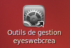
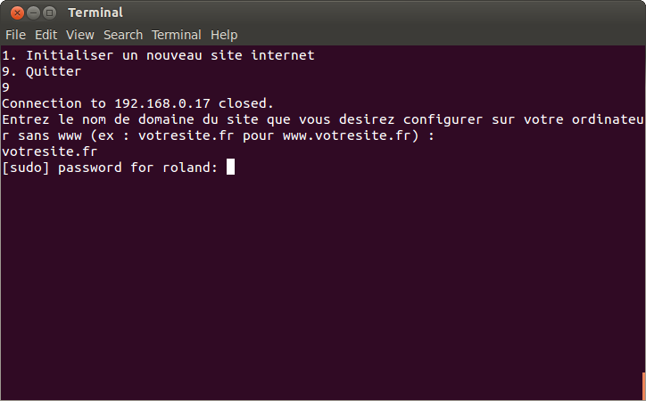

Initialisation d'un site internet
=================================

1. double cliquer sur le fichier manage.sh situé sur votre bureau

2. Une fenetre s'ouvre 

3. On vous demande 'Do you want to run "manage.sh", or display its contents ?'
   Traduction : Desirez vous executer ce fichier ou visualiser son contenu
   

   
4. Choisisez d'éxcuter en cliquant sur 'Run in Terminal' (Lancer dans le terminal de commande)

3. On vous demande L'action que vous desirez executer

.. image:: images/1-4.png

4. Taper 1 puis entrer pour executer l'action 'Initaliser un nouveau site internet...'

5. Tapez le mot de passe qui vous est demande : 147258

6. On vous demande L'action que vous desirez executer

7. Taper 1 puis entrer pour executer l'action 'Initaliser un nouveau site internet' 

8. On vous demande le nom du site que vous devirez initialiser

.. image:: images/1-7.png
 
9. Taper le puis appuyez sur entrer 

13. Tapez le mot de passe qui vous est demande : 147258

10. Patientez

.. image:: images/1-9.png

11. On vous demande le nom du domaine du site que vous desirez configurer sur votre ordinateur

12. Entre le nom de domaine du site sans les www

13. Tapez le mot de passe du votre compte utilisateur de votre machine local

14. Le site s'ouvre tous seul dans chrome et deux favoris supplementaire se sont crée pour 
    Acceder au site internet et a son panel d'administration
    

15. Entrez vos acces développeur github