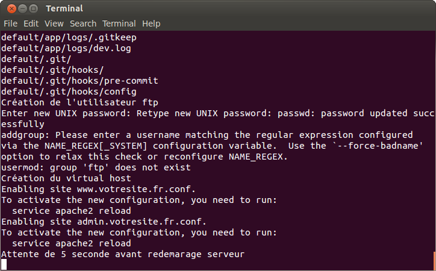

Publication d'un site internet
=================================

1. Reportez vous à la question n°7 de la faq pour lancer 'l'outils de gestion eyeswebcrea' puis faites ce qui suit.

2. On vous demande L'action que vous desirez executer

3. Taper 7 puis entrer pour executer l'action 'Publier un site en production...'
New Folder
4. Tapez le mot de passe qui vous est demande : 147258

.. image:: images/1-5.png

5. On vous demande L'action que vous desirez executer

.. image:: images/1-6.png

6. Taper 1 puis entrer pour executer l'action 'Publier un site en production' 

7. On vous demande le nom du site que vous devirez initialiser

 
8. Taper le puis appuyez sur entrer 

9. Tapez le mot de passe qui vous est demande : 147258

.. image:: images/1-8.png

10. Patientez

.. image:: images/1-10.png

11. On vous demande le nom du domaine du site que vous desirez configurer sur votre ordinateur

.. image:: images/1-11.png

12. Entre le nom de domaine du site sans les www

13. Tapez le mot de passe du votre compte utilisateur de votre machine local

.. image:: images/1-12.png

14. Le site s'ouvre tous seul dans chrome et deux favoris supplementaire se sont crée pour 
    Acceder au site internet et a son panel d'administration
    
.. image:: images/1-13.png

15. Entrez vos acces développeur github

